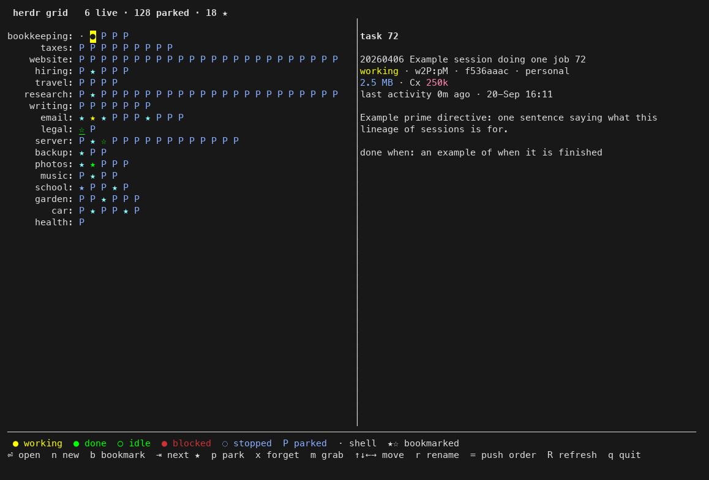

# herdr session grid

One picker for every herdr workspace and tab: each workspace a row, each tab a cell, arrow keys move, Enter opens. Sessions with no running process keep a cell ("parked") so one keypress brings them back.

- `herdr-grid-screenshot.png` — the grid as it looks, every name replaced by `run --demo`
- `herdr_session_grid.py` — the grid itself (python, curses; `hg` runs it in its own herdr pane)
- `cli-herdr-grid.md` — what it does, every key, the decisions behind it
- `herdr_session_manage.sh` — the session manager the grid calls for open, park, resume, move, new
- `record-herdr-tab.sh` — Claude Code SessionStart hook: records which herdr tab holds which session
- `herdr_session_record_live.sh` — per-minute cron catching tabs whose session moved

Built for herdr (the terminal multiplexer) and Claude Code sessions on macOS. The scripts read herdr's socket and Claude Code's transcript folder; paths are at the top of each file.
